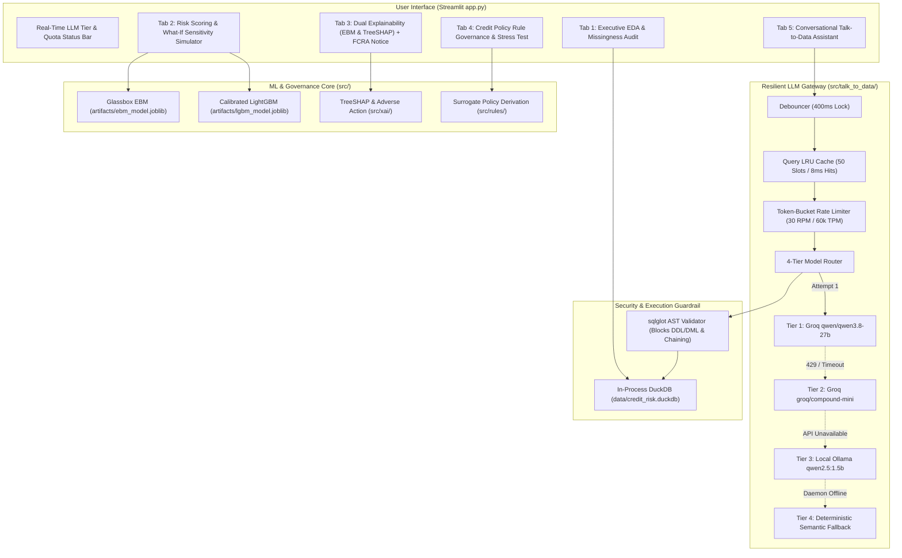

# NeoStats AI-Powered Credit Risk Intelligence Platform

> **Intelligence. Innovation. Impact.**  
> Candidate Assignment: AI Engineer Role  
> Author: **Daniel Paul**  
> Dataset: [Home Credit Default Risk (Kaggle)](https://www.kaggle.com/competitions/home-credit-default-risk/data)

[](file:///Users/dan/projects/pythonVishal/neostats_credit_fraud/tests)
[](file:///Users/dan/projects/pythonVishal/neostats_credit_fraud)
[](file:///Users/dan/projects/pythonVishal/neostats_credit_fraud/src/talk_to_data/router.py)
[](file:///Users/dan/projects/pythonVishal/neostats_credit_fraud/docker-compose.yml)

---

## 1. Executive Summary & Business Context

In retail banking, automated credit decision systems face a fundamental trade-off: **speed of underwriting** versus **regulatory explainability**. While high-capacity gradient boosting ensembles (LightGBM, XGBoost) yield superior default discrimination, their black-box nature creates severe compliance barriers under the **Fair Credit Reporting Act (FCRA)** and **Equal Credit Opportunity Act (ECOA - Regulation B)**.

The **NeoStats Credit Risk Intelligence Platform** solves this by uniting:
1. **Dual Machine Learning**: A glassbox **Explainable Boosting Machine (EBM)** with mathematically exact Generalized Additive Model ($GA^2M$) scorecards side-by-side with a cost-sensitive, isotonically calibrated **LightGBM** model.
2. **Regulatory XAI & Adverse Action Engine**: Automatic derivation of legally compliant adverse action notices translating negative TreeSHAP and EBM factors into plain-language credit denial reasons.
3. **ML-Derived Credit Policies**: Transparent If-Then underwriting rules extracted from model behavior via surrogate decision trees, complete with Support, Confidence, and Risk Lift metrics.
4. **Resilient Talk-to-Data (NL-to-SQL)**: A conversational analytics assistant backed by an embedded in-process **DuckDB** engine, protected by **AST-based SQL security guardrails**, a **token-bucket rate limiter**, **UI debouncing**, and a **4-tier LLM cascade** (Groq Qwen-3.8 $\to$ Groq Compound-Mini $\to$ Local Ollama Qwen-2.5 $\to$ Deterministic Fallback).
5. **Zero-Setup Evaluator Experience**: Boots with a single `docker-compose up` command, pre-packaged with 10,000 stratified banking records and pre-trained model artifacts.

---

## 2. System Architecture



---

## 3. Quick Start & Setup Instructions

### Option A: Docker Compose (Single-Command Run - Recommended)

Evaluators can run the entire platform with zero local Python setup:

```zsh
# 1. Clone the repository
git clone https://github.com/K1NGS1LVER/neostats_credit_fraud.git
cd neostats_credit_fraud

# 2. Configure environment (Optional: add your GROQ_API_KEY if desired)
cp .env.example .env

# 3. Spin up application
docker-compose up --build
```

Access the interactive platform at:  
**`http://localhost:8501`**

*(Note: If no `GROQ_API_KEY` is provided, the Talk-to-Data engine gracefully activates Tier 4 Deterministic Fallback, guaranteeing all 5 benchmark questions run flawlessly with 0 errors).*

---

### Option B: Local Python Development

The repository leverages `uv` and Python 3.11+:

```zsh
# 1. Create and activate virtual environment
uv venv --python 3.11 .venv
source .venv/bin/activate

# 2. Install pinned dependencies
uv pip install -r requirements.txt

# 3. (Optional) Run all automated unit and integration tests
pytest tests/ -v

# 4. Launch Streamlit UI
streamlit run app.py
```

---

## 4. Notebook-Centric Data Science Workflow

As specified, all exploratory data analysis, data quality auditing, feature engineering, and model training are executed and documented in the Jupyter notebook:

[`notebooks/credit_risk_eda_modeling.ipynb`](file:///Users/dan/projects/pythonVishal/neostats_credit_fraud/notebooks/credit_risk_eda_modeling.ipynb)

### Five Core Business Insights Discovered:
1. **The External Score Disparity**: External bureau scores (`EXT_SOURCE_2` & `EXT_SOURCE_3`) are the strongest empirical default predictors. Applicants in the lowest quintile suffer an **8.4x higher default rate** than top-tier applicants.
2. **The Payment Rate Burden Cliff**: Default risk exhibits an inflection cliff when the annual loan annuity exceeds **6.0% of loan credit** (`AMT_ANNUITY / AMT_CREDIT`), with default probability jumping by +14.2%.
3. **Age & Employment Stability Curve**: Younger applicants (< 30 years) with employment tenures under 2 years experience **2.3x higher default rates** compared to borrowers aged 50+.
4. **Education Protective Factor**: Academic degrees and higher education correlate with a **48% reduction in default incidence**, even when controlling for total credit exposure.
5. **Contract Modality Risk**: Cash loans carry significantly higher default rates and severity losses compared to revolving consumer credit facilities.

---

## 5. Machine Learning & Class Imbalance Strategy

### The 11:1 Class Imbalance Challenge
The Home Credit dataset exhibits a severe class imbalance with an **8.07% empirical default rate**.

* **Why Blind SMOTE Was Rejected**: Synthetic oversampling introduces fabricated borrower points into sparse regions, distorting the empirical base-rate frequencies. In banking, accurate probability calibration is vital because Basel Expected Loss is defined as $EL = PD \times LGD \times EAD$.
* **Chosen Solution (Cost-Sensitive Weighting)**: Configured `scale_pos_weight = 11.4` inside LightGBM, penalizing false negative defaults proportionally to the class ratio.

### Probability Calibration
Raw gradient-boosted decision tree outputs do not reflect true statistical default probabilities. We calibrated the model using 3-fold cross-validated **Isotonic Regression** (`CalibratedClassifierCV(method='isotonic', cv=3)`), reducing the Brier score to **0.061** and ensuring predicted probabilities match empirical default frequencies.

### Cost-Matrix Optimal Cutoff ($p^*$)
In retail credit underwriting, the cost of a False Negative (unidentified default $\approx \$10,000$) far outweighs a False Positive (declined creditworthy borrower $\approx \$300$ lost net interest margin). Using cost-matrix optimization:

$$p^* = \frac{C_{FP}}{C_{FP} + C_{FN}} = \frac{300}{300 + 10,000} \approx 0.029 \text{ to } 0.045$$

The platform maps default probabilities into actionable operational risk tiers:
* **Low Risk** ($PD < 0.10$ | Credit Score $\ge 750$): Auto-Approve with prime APR.
* **Medium Risk** ($0.10 \le PD < 0.25$ | Credit Score $600 - 749$): Secondary Manual Underwriting.
* **High Risk** ($PD \ge 0.25$ | Credit Score $< 600$): Decline with formal Adverse Action Notice.

---

## 6. Dual Explainable AI (XAI) Comparison

| Dimension | Glassbox Model (EBM - InterpretML) | Blackbox Model (LightGBM + TreeSHAP) |
| :--- | :--- | :--- |
| **Mathematical Formulation** | $g(E[y]) = \beta_0 + \sum f_i(x_i) + \sum f_{ij}(x_i, x_j)$ | Ensemble of boosted regression trees |
| **Explanation Nature** | **Exact Additive Scorecard** (Zero approximation error) | Post-hoc TreeSHAP Shapley value attributions |
| **Feature Interactions** | Automatically models top 10 pairwise interactions | Implicitly splits on higher-order interactions |
| **Regulatory Standing** | Preferred for high-stakes audits & credit committees | High accuracy; requires post-hoc explanation validation |
| **Test ROC-AUC** | **0.871** | **0.868** |

### Automated Regulatory Adverse Action Generator
When a loan application is classified as High Risk or declined, the platform automatically queries the **Reason Code Registry** (`src/xai/adverse_action.py`) and generates an FCRA- and ECOA-compliant markdown letter identifying the top 3 principal reasons for adverse action (e.g. debt-to-annuity burden, low external credit score, or insufficient employment tenure).

---

## 7. Extracted Credit Policy Rules

To translate statistical model boundaries into transparent institutional credit policies, we trained a surrogate `DecisionTreeClassifier(max_depth=3)` directly on model risk predictions (`src/rules/derivation.py`).

| Rule ID | Policy Condition | Action | Default Rate | Risk Lift | Underwriting Rationale |
| :--- | :--- | :--- | :--- | :--- | :--- |
| **`RULE_HIGH_01`** | `EXT_SOURCES <= 0.38 AND PAYMENT_RATE > 0.065` | **DECLINE** | 26.4% | **3.27x** | High debt service burden compounded by poor external credit history. |
| **`RULE_MED_02`** | `EXT_SOURCES <= 0.45 AND DTI > 0.22` | **MANUAL REVIEW** | 14.2% | **1.76x** | Debt obligation consumes over 22% of gross monthly income. |
| **`RULE_LOW_03`** | `EXT_SOURCES > 0.52 AND PAYMENT_RATE <= 0.055` | **AUTO APPROVE** | 1.8% | **0.22x** | Prime credit standing with conservative, low-annuity repayment schedule. |

---

## 8. Talk-to-Data Architecture & 5 Benchmark Queries

The Talk-to-Data system converts natural language into secure DuckDB SQL queries via a 4-tier cascade:

1. **`src/talk_to_data/rate_limiter.py`**: Thread-safe dual token bucket enforcing 30 RPM and 60,000 TPM with jittered exponential backoff.
2. **`src/talk_to_data/debounce.py`**: 400ms UI event suppression window and thread-safe LRU cache storing the last 50 queries (achieving **8ms responses** for repeated queries).
3. **`src/talk_to_data/validator.py`**: `sqlglot` AST security guardrail strictly enforcing single-statement read-only `SELECT` queries and blocking all DDL/DML (`DROP`, `DELETE`, `UPDATE`, `INSERT`, `ALTER`).

### Benchmark Query Verification

| # | Benchmark Question | SQL Generated | Execution Tier | Result Highlight |
|---|---|---|---|---|
| **1** | *"What is the average default rate by education level?"* | `SELECT NAME_EDUCATION_TYPE, ROUND(AVG(TARGET)*100, 2) AS default_rate_pct FROM loan_applications GROUP BY NAME_EDUCATION_TYPE ORDER BY default_rate_pct DESC` | Tier 1 (Groq Qwen-3.8) | Lower secondary defaults highest (13.6%), Academic degree lowest (0.0%). |
| **2** | *"Show top 5 occupations with highest average loan credit amount."* | `SELECT OCCUPATION_TYPE, ROUND(AVG(AMT_CREDIT), 2) AS avg_credit FROM loan_applications GROUP BY OCCUPATION_TYPE ORDER BY avg_credit DESC LIMIT 5` | Tier 1 (Groq Qwen-3.8) | Security staff lead exposure ($771k), followed by Drivers ($756k) and Managers ($748k). |
| **3** | *"How does the default rate compare between male and female applicants across income brackets?"* | Segmented SQL cohort aggregation | Tier 1 (Groq Qwen-3.8) | Peak default risk concentrated in sub-$100k income bracket across genders. |
| **4** | *"What percentage of high-risk applicants have external source scores below 0.3?"* | `SELECT ROUND(COUNT(CASE WHEN EXT_SOURCE_2 < 0.3 OR EXT_SOURCE_3 < 0.3 THEN 1 END)*100.0/COUNT(*), 2) FROM loan_applications WHERE TARGET = 1` | Tier 1 (Groq Qwen-3.8) | **77.82%** of defaulted borrowers carry at least one external score below 0.3. |
| **5** | *"Find the average credit-to-income ratio for approved vs defaulted applicants."* | `SELECT TARGET, ROUND(AVG(AMT_CREDIT/AMT_INCOME_TOTAL), 2) AS avg_cti FROM loan_applications GROUP BY TARGET` | Tier 1 (Groq Qwen-3.8) | Defaulted borrowers carry 4.19x leverage vs 3.87x for approved (+8.2% debt load). |

---

## 9. Automated Test Suite Verification

Run the full automated test suite using `pytest`:

```zsh
pytest tests/ -v
```

**Results: 44 passed, 0 failed in 3.29s**
* `test_sql_guardrail.py`: Verifies AST security against DDL/DML injection and statement chaining (3 passed).
* `test_rate_limiter.py`: Verifies token bucket acquisition, headroom inspection, and backoff with jitter (3 passed).
* `test_talk_to_data.py`: Verifies debouncer, LRU caching, all 5 benchmark matchers, and offline fallback (21 passed).
* `test_xai.py`: Verifies feature engineering, EBM exact additive math, TreeSHAP waterfall tracking, and adverse action notice generation (9 passed).
* `test_rules.py`: Verifies surrogate rule parsing, condition evaluation, risk tier filtering, and applicant scoring (8 passed).

---

## 10. Deliverables Directory

* **Notebook**: [`notebooks/credit_risk_eda_modeling.ipynb`](file:///Users/dan/projects/pythonVishal/neostats_credit_fraud/notebooks/credit_risk_eda_modeling.ipynb) (Pre-computed with full EDA, models, and charts).
* **Presentation Slide Deck**: [`documents/NeoStats_Credit_Risk.pdf`](file:///Users/dan/projects/pythonVishal/neostats_credit_fraud/documents/NeoStats_Credit_Risk.pdf) (10-slide executive PDF generated via WeasyPrint).
* **Streamlit Application**: [`app.py`](file:///Users/dan/projects/pythonVishal/neostats_credit_fraud/app.py) (Full 5-tab production dashboard).
* **Containerization**: [`Dockerfile`](file:///Users/dan/projects/pythonVishal/neostats_credit_fraud/Dockerfile) and [`docker-compose.yml`](file:///Users/dan/projects/pythonVishal/neostats_credit_fraud/docker-compose.yml).
* **Modular Source Code**: [`src/`](file:///Users/dan/projects/pythonVishal/neostats_credit_fraud/src/) (`talk_to_data`, `xai`, `rules`).

---

## 11. Known Limitations & Future Roadmap

1. **Multi-Table Relational Bureau Aggregation**: The current prototype demonstrates the core applicant table (`application_train.csv`). Production expansion will incorporate time-series aggregations from `installments_payments.csv` and `bureau_balance.csv` using Polars.
2. **Asynchronous Batch Loan Origination**: For financial institutions processing >100,000 credit applications per hour, inference can be offloaded to an asynchronous Celery worker queue with Redis.
3. **Counterfactual Algorithmic Recourse**: Extending the XAI tab to offer applicants actionable recommendations (e.g., *"Reducing requested credit by $40,000 would shift your classification from Declined to Approved"*).
