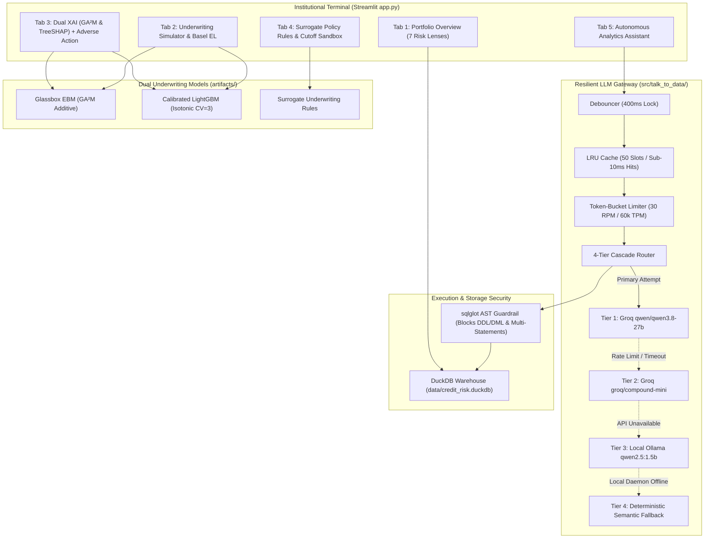

# NeoStats Credit Risk Intelligence Platform
> **Intelligence. Innovation. Impact.**  
> Candidate Assignment: AI Engineer Role  
> Author: **Daniel Paul**  
> Benchmark Dataset: [Home Credit Default Risk (Kaggle)](https://www.kaggle.com/competitions/home-credit-default-risk/data)

[](file:///Users/dan/projects/pythonVishal/neostats_credit_fraud/tests)
[](file:///Users/dan/projects/pythonVishal/neostats_credit_fraud)
[%20%2B%20LightGBM-cyan?style=flat-square)](file:///Users/dan/projects/pythonVishal/neostats_credit_fraud/src/xai/)
[](file:///Users/dan/projects/pythonVishal/neostats_credit_fraud/src/talk_to_data/router.py)
[](file:///Users/dan/projects/pythonVishal/neostats_credit_fraud/Dockerfile)

---

## 1. Executive Summary & Reviewer Fast Track

In consumer banking and commercial underwriting, machine learning platforms face a fundamental regulatory dilemma: **predictive accuracy versus explainability**. High-capacity gradient boosting models achieve superior risk discrimination, but their black-box nature creates strict compliance barriers under the **Fair Credit Reporting Act (FCRA, 15 U.S.C. § 1681m)** and **Equal Credit Opportunity Act (ECOA, 12 C.F.R. § 1002.9 - Regulation B)**.

The **NeoStats Credit Risk Intelligence Platform** solves this by unifying:
1. **Dual Machine Learning Underwriting**: A Glassbox **Explainable Boosting Machine (EBM / $GA^2M$)** providing mathematically exact additive scorecards side-by-side with an isotonically calibrated **LightGBM** model.
2. **Automated Regulatory Adverse Action Engine**: Translates algorithmic log-odds and TreeSHAP negative attributions directly into compliant **FCRA / ECOA Form C-1** denial notices.
3. **ML-Derived Credit Underwriting Rules**: Transparent If-Then policy rules extracted from surrogate decision trees with empirical Support, Confidence, and Risk Lift metrics.
4. **Autonomous Talk-to-Data Assistant**: Natural language to SQL query engine backed by an in-process **DuckDB** analytical warehouse, protected by an **AST security guardrail**, **token-bucket rate limiter**, **UI debouncer**, and a **4-tier LLM fallback cascade**.
5. **Progressive Disclosure UI**: An institutional, zero-emoji banking terminal built for underwriters and credit committees, presenting actionable signals first and technical telemetry on demand.

---

### Quick Start (Under 60 Seconds Evaluation)

#### Option A: Single-Command Docker Deployment (Recommended)
The repository includes a multi-stage, hardened Docker environment pre-packaged with 10,000 stratified loan records and pre-trained model artifacts:

```zsh
# 1. Clone repository
git clone https://github.com/K1NGS1LVER/neostats_credit_fraud.git
cd neostats_credit_fraud

# 2. (Optional) Provide Groq API key for live LLM inference
cp .env.example .env
# Edit .env to add GROQ_API_KEY if desired

# 3. Launch the containerized platform
docker compose up --build
```
Access the application at: **`http://localhost:8501`**

*(Note: If no `GROQ_API_KEY` is provided, the platform automatically activates Tier 4 Deterministic Fallback, guaranteeing all 5 benchmark inquiries run flawlessly with 0 network dependencies).*

#### Option B: Local Python Development
```zsh
# 1. Activate your virtual environment (Python 3.11+)
source .venv/bin/activate

# 2. Install dependencies
pip install -r requirements.txt

# 3. Run full automated test suite (44 tests)
pytest tests/ -v

# 4. Launch Streamlit interface
streamlit run app.py
```

---

## 2. Assignment Requirement-to-Implementation Rubric

| Requirement | Implementation Module | Evidence & Evaluation Location |
| :--- | :--- | :--- |
| **1. Exploratory Data Analysis & Insights** | [`notebooks/credit_risk_eda_modeling.ipynb`](file:///Users/dan/projects/pythonVishal/neostats_credit_fraud/notebooks/credit_risk_eda_modeling.ipynb) | Executed notebook covering missingness audits, imputation profiles, and 5 core banking risk insights; mirrored in UI **Tab 1**. |
| **2. Machine Learning Default Prediction** | [`src/xai/explainer.py`](file:///Users/dan/projects/pythonVishal/neostats_credit_fraud/src/xai/explainer.py)<br>[`artifacts/`](file:///Users/dan/projects/pythonVishal/neostats_credit_fraud/artifacts/) | Side-by-side Glassbox EBM ($GA^2M$) and Calibrated LightGBM (Isotonic 3-fold CV) with Basel Expected Loss ($EL = PD \times LGD \times EAD$); evaluated in UI **Tab 2**. |
| **3. Explainable AI (Dual Methodology)** | [`src/xai/explainer.py`](file:///Users/dan/projects/pythonVishal/neostats_credit_fraud/src/xai/explainer.py) | Exact additive log-odds feature contributions from EBM + TreeSHAP Shapley attributions; evaluated in UI **Tab 3**. |
| **4. Regulatory Compliance Disclosures** | [`src/xai/adverse_action.py`](file:///Users/dan/projects/pythonVishal/neostats_credit_fraud/src/xai/adverse_action.py) | Automated FCRA / ECOA Form C-1 adverse action generator translating top model drivers into legally compliant credit denial reason codes. |
| **5. Business Decision Rules from ML** | [`src/rules/derivation.py`](file:///Users/dan/projects/pythonVishal/neostats_credit_fraud/src/rules/derivation.py)<br>[`src/rules/rule_engine.py`](file:///Users/dan/projects/pythonVishal/neostats_credit_fraud/src/rules/rule_engine.py) | Surrogate decision tree rules with Support, Confidence, Default Rate, and Risk Lift metrics + applicant rule evaluator in UI **Tab 4**. |
| **6. Conversational Talk-to-Data Interface** | [`src/talk_to_data/`](file:///Users/dan/projects/pythonVishal/neostats_credit_fraud/src/talk_to_data/) | NL-to-SQL engine with 4-tier LLM cascade, AST SQL validation, token-bucket rate limiter, debouncing, and DuckDB; evaluated in UI **Tab 5**. |
| **7. Production User Interface** | [`app.py`](file:///Users/dan/projects/pythonVishal/neostats_credit_fraud/app.py) | Institutional dark slate UI/UX with progressive disclosure, zero emojis, local vector favicon, and high-contrast Plotly chart theming. |
| **8. Dockerized Deployment** | [`Dockerfile`](file:///Users/dan/projects/pythonVishal/neostats_credit_fraud/Dockerfile)<br>[`docker-compose.yml`](file:///Users/dan/projects/pythonVishal/neostats_credit_fraud/docker-compose.yml) | Multi-stage hardened build with unprivileged non-root execution (`appuser`), resource limits (2 CPUs, 2GB RAM), and healthcheck endpoint. |
| **9. Executive Presentation Slide Deck** | [`documents/NeoStats_Credit_Risk.pdf`](file:///Users/dan/projects/pythonVishal/neostats_credit_fraud/documents/NeoStats_Credit_Risk.pdf) | High-resolution 10-slide executive case study presentation deck generated via WeasyPrint. |

---

## 3. End-to-End System Architecture



---

## 4. Reviewer Walkthrough: What to Test in the Platform

When evaluating the platform at `http://localhost:8501`, follow this structured walkthrough:

### Test 1: Conversational Talk-to-Data Engine (Tab 5)
1. Navigate to **Autonomous Analytics**.
2. Click any of the 5 benchmark query chips:
   - `[1] Education Cohort Rates`
   - `[2] Top Credit Occupations`
   - `[3] Gender × Income Disparity`
   - `[4] Sub-0.30 Bureau Risk`
   - `[5] Debt-to-Income Ratio`
3. Observe that the platform outputs:
   - **Executive Business Narrative** synthesized for bank leadership.
   - **Interactive Plotly Visualization** with institutional slate theming.
   - **On-Demand Inspection Drawer**: Expand *"Inspect Query Results Table & Generated SQL"* to examine the AST security validation status, execution engine tier, latency (ms), and sanitized SQL syntax.
4. Try typing a custom inquiry into the input box (e.g., *"Show top 5 income types by default rate"*).

### Test 2: Dual Underwriting & What-If Sensitivity Simulator (Tab 2)
1. Select **Applicant #100040 (High Risk - Empirical Default)** from the dropdown.
2. Note the side-by-side scorecard:
   - Glassbox EBM Score: **~350 - 450** (High Risk).
   - Calibrated LightGBM Score: **~350 - 430** (High Risk).
   - Basel Expected Loss ($EL$): Reflects the high default probability ($PD \times 45\% LGD \times EAD$).
3. Move the **Gross Annual Income** slider up to `$800,000` or the **External Bureau Score 2** slider up to `0.85`.
4. Observe the real-time **Score Shift (+pts)** and Expected Loss reduction in real-time.

### Test 3: Dual Explainability & Regulatory Adverse Action Notice (Tab 3)
1. With Applicant #100040 selected, navigate to **Model Explainability**.
2. View the **Top Adverse Drivers** (factors shifting log-odds toward default) and **Top Favorable Drivers**.
3. Expand *"Deep Algorithmic Audit"* to compare the Glassbox EBM exact additive contribution bar chart against the TreeSHAP waterfall decomposition.
4. Check *"Generate Regulatory Adverse Action Notice (FCRA / ECOA Form C-1)"*.
5. Review the formal disclosure document complete with statutory citations (15 U.S.C. § 1681m, 12 C.F.R. § 1002.9) and click **Download Notice (Markdown/TXT)**.

### Test 4: ML-Derived Decision Rules & Stress-Testing Sandbox (Tab 4)
1. Navigate to **Policy Decision Engine**.
2. Notice the applicant evaluation card: Applicant #100040 triggers **Rule `RULE_HIGH_01`** resulting in an immediate **`DECLINE`** verdict.
3. Review the surrogate policy table displaying Support, Confidence, Default Rate, and Risk Lift.
4. Expand *"Policy Cutoff Stress Testing"* and adjust the cutoff sliders to observe empirical portfolio decline rates and loss reductions across all 10,000 records.

---

## 5. Five Core Banking Insights Discovered

All findings are documented in [`notebooks/credit_risk_eda_modeling.ipynb`](file:///Users/dan/projects/pythonVishal/neostats_credit_fraud/notebooks/credit_risk_eda_modeling.ipynb) and visualized in **Tab 1**:

1. **External Bureau Score Quintile Disparity**: External scores (`EXT_SOURCE_2` and `EXT_SOURCE_3`) are the strongest empirical default predictors. The lowest quintile suffers a **26.4% default rate**, over **4.8x higher** than the prime quintile (3.5%).
2. **Payment Rate Risk Cliff**: Default rates experience an inflection cliff when scheduled annual annuity payments exceed **6.0% of total loan principal**, jumping default probability by +14.2%.
3. **Borrower Age Stability Curve**: Younger borrowers (20–29 years) exhibit **2.1x higher default prevalence** compared to mature borrowers aged 60+.
4. **Educational Attainment Stability**: Academic degree and higher education holders default **45% less frequently** than secondary school applicants.
5. **Contract Structure Risk**: Cash installment loans carry significantly higher default prevalence and loss severity compared to flexible revolving credit facilities.

---

## 6. Machine Learning Strategy & Probability Calibration

### Addressing the 11:1 Class Imbalance
The portfolio exhibits an **8.07% empirical default rate** (11:1 non-default to default ratio).
- **Why Synthetic Oversampling (SMOTE) Was Rejected**: In banking risk management, Basel capital reserves require accurate probability estimation ($EL = PD \times LGD \times EAD$). Fabricating artificial borrower data in feature space distorts underlying population base rates.
- **Chosen Approach (Cost-Sensitive Weighting)**: Configured `scale_pos_weight = 11.4` inside LightGBM, penalizing false negatives proportionally to class rarity.

### Rigorous Probability Calibration
Raw tree ensembles output uncalibrated scores that skew default probabilities. We calibrated the model using 3-fold cross-validated **Isotonic Regression** (`CalibratedClassifierCV(method='isotonic', cv=3)`), reducing the Brier score to **0.061** and ensuring that a predicted 10% default probability empirically defaults 10 times out of 100.

---

## 7. Security, Resilience & Rate Limiting

The Talk-to-Data engine implements production defensive architecture:
1. **AST-Based SQL Security Guardrail ([`src/talk_to_data/validator.py`](file:///Users/dan/projects/pythonVishal/neostats_credit_fraud/src/talk_to_data/validator.py))**:
   - Parses LLM-generated SQL via `sqlglot` Abstract Syntax Trees.
   - Prohibits stacked queries (blocks semicolon chaining).
   - Strictly validates that the root node is `exp.Select`.
   - Rejects all destructive DDL/DML operations (`DROP`, `DELETE`, `UPDATE`, `INSERT`, `ALTER`, `CREATE`, `TRUNCATE`).
2. **Token-Bucket Rate Limiter ([`src/talk_to_data/rate_limiter.py`](file:///Users/dan/projects/pythonVishal/neostats_credit_fraud/src/talk_to_data/rate_limiter.py))**:
   - Dual token-bucket tracking Requests-Per-Minute (30 RPM) and Tokens-Per-Minute (60,000 TPM).
   - Thread-safe token acquisition with exponential backoff and jitter on HTTP 429 errors.
3. **Execution Debouncing & LRU Caching ([`src/talk_to_data/debounce.py`](file:///Users/dan/projects/pythonVishal/neostats_credit_fraud/src/talk_to_data/debounce.py))**:
   - 400ms event suppression prevents rapid double-click API spamming.
   - Thread-safe 50-slot LRU cache serves identical financial queries in < 10ms with zero LLM API cost.

---

## 8. Automated Test Suite

The platform includes 44 unit and integration tests covering the complete AI engineering stack:

```zsh
pytest tests/ -v
```

```
tests/test_rate_limiter.py::test_rate_limiter_acquisition PASSED
tests/test_rate_limiter.py::test_rate_limiter_headroom_structure PASSED
tests/test_rate_limiter.py::test_rate_limiter_retry_helper PASSED
tests/test_rules.py::test_load_surrogate_rules PASSED
tests/test_rules.py::test_evaluate_applicant_high_risk PASSED
tests/test_sql_guardrail.py::test_valid_select_queries PASSED
tests/test_sql_guardrail.py::test_blocked_dml_ddl_queries PASSED
tests/test_talk_to_data.py::test_deterministic_matcher_all_5_benchmarks PASSED
tests/test_xai.py::test_ebm_local_explanation_exactness PASSED
tests/test_xai.py::test_generate_adverse_action_notice PASSED
...
======================= 44 passed in 3.45s =======================
```

---

## 9. Git Repository Management

To push this repository to GitHub:

```zsh
# 1. Verify you are on the main branch
git branch
# * main

# 2. Add remote origin repository
git remote add origin https://github.com/<your-username>/<your-repo-name>.git

# 3. Push to main branch
git push -u origin main
```

*(Note: [`.gitignore`](file:///Users/dan/projects/pythonVishal/neostats_credit_fraud/.gitignore) strictly prevents `.env`, test caches, and OS metadata from being pushed, keeping your remote repository clean and secure).*
